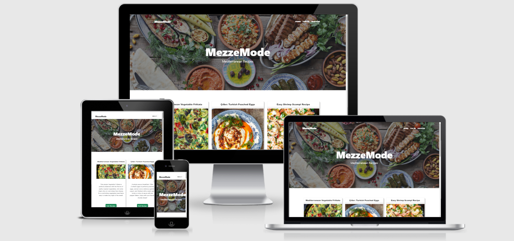
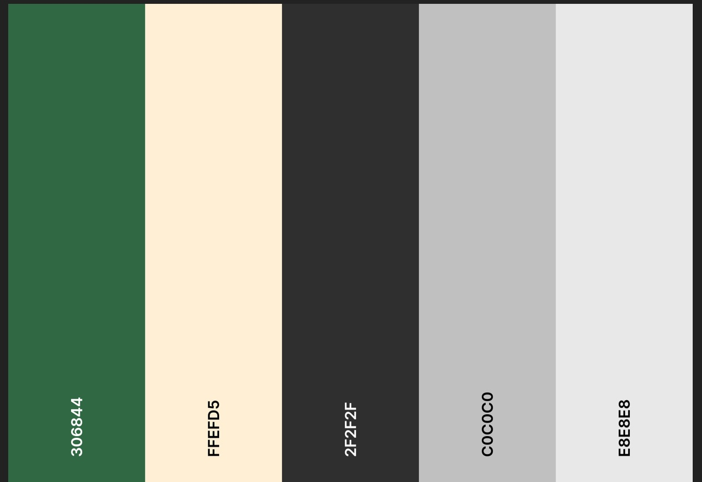
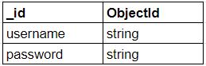
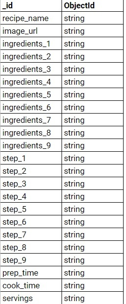

# MezzeMode

For my third milestone project, I have decided to create a cooking website. To break it down a little bit, the site contains recipes from the well know Mediterranean diet. 

This diet incorporates the traditional healthy living habits of people from countries bordering the Mediterranean Sea.

Plant-based foods, such as whole grains, vegetables, legumes, fruits, nuts, seeds, herbs and spices, are the foundation of this particular diet and olive oil is the main source of added fat. Fish, seafood, dairy and poultry are also included, but in moderation. 

### Table of contents 
* [UX (User Experience)](#ux--user-experience-)
    + [User Stories](#user-stories)
    + [User Goals](#user-goals)
* [Design](#design) 
    + [Color Scheme](#colorscheme) 
    + [Typography](#typography)
* [Wireframes](#wireframes)    
* [Features](#features)
   + [Existing Features](#existing-features)
   + [Future Features](#future-features) 
* [Information Architecture](#information-architecture)
* [Admin Credentials](#admin-credentials)
* [Technologies Used](#technologies-used)
   + [Languages Used](#languages-used)
   + [Frameworks](#frameworks)
* [Testing](#testing)
    + [User Stories Testing]()
    + [Further Testing]()
* [Bugs](#bugs)
* [Unsolved Bugs]()
* [Deployment](#deployment)
    + [Instructions](#instructions)
    + [Heroku Deployment](#deployment)
* [Credits](#credits)
    + [Content]()
    + [Media]()
    + [Aknowledgements]()

## UX
****
### User Stories
1. 
### User Goals
As a user, I would like to :
* easily find recipes of my liking 
* have the possibility of creating my own profile
* add recipes that do not appear on the website
* update my personal recipes
* delete my personal recipes

### User Requirements and Expectations
* intuitive layout
* user friendly
* easy to use 
* accessible on multiple devices, such as laptops, tablets and phones

## Design
****
### Colour Scheme

For this particular project, I chose to go with a shade of Hunter Green and Papaya Whip (which both compliment the hero image), Jet (black) and Platinum(white) for the text and Silver for the card edges. 

### Typography
The font I have used throughout my website is Roboto, with Sans Serif as a fallback.

## Wireframes
****

## Features
****
### Existing features

### Future features
* Adding the possibility of resetting the password.
* Adding email as an option for username.
* Promote a brand of kitchen utensils. 

## Information architecture
****
User Data

Recipe Data

## Admin credentials
****

## Technologies Used 
****
### Languages Used

   * [HTML](https://en.wikipedia.org/wiki/HTML)

   * [CSS](https://en.wikipedia.org/wiki/CSS)

   * [Javascript](https://en.wikipedia.org/wiki/JavaScript)

   * [Python](https://en.wikipedia.org/wiki/Python_(programming_language))

### Frameworks
* [Flask](https://flask.palletsprojects.com/en/2.0.x/)

* [Werkzeug](https://flask.palletsprojects.com/en/2.0.x/)

* [Jinja](https://flask.palletsprojects.com/en/2.0.x/)

* [Favicon](https://en.wikipedia.org/wiki/Favicon)

* [MDB Bootstrap](https://mdbootstrap.com/)

* [MongoDB](https://www.mongodb.com/cloud/atlas/register)

* [Start Bootstrap](https://startbootstrap.com/)

* [GitHub](https://github.com/)

* [Gitpod](https://www.gitpod.io/)

## Testing
****
    W3C Markup Validator - 
    Jigsaw CSS Validator - 
    JSHint - 
    PEP8 - 
### User stories testing
#### User goals: 
1.  easily find recipes of my liking :
    * the site has been created in such way that the users only have to access the site and they will have the information displayed on the front page

* have the possibility of creating their own profile
    * the users have the possibility of creating an account through the Register option found in the Navbar; if they already have an account, they will be promted to log in (direct link from the registration form to the login page) 
* add recipes that do not appear on the website
    * after the users have succesfully registered or logged in, they can add a new recipe through the Add Recipe button found in the Navbar.
* update personal recipes
    * the users can later update their recipes from their personal profile
* delete personal recipes
    * the users can later update their recipes from their personal profile
### Further testing
 * Website was tested on Chrome, Opera, P30 Pro and Samsung S21 Ultra, with no issues. While testing on  Huawei P20 Pro, the card images were not loading. 
## Bugs
****
1. Upstreaming issue - Git was aware of Github, but not using it after early deployment to Heroku. Pushed information only visile in Heroku.
Solved with: 

        git config --get remote.origin.url
		git branch -vv
		git branch (response * main)
		git push --set-upstream https://github.com/
            kuszturareka/mezze-mode.git main
        git push origin main
2. Missmatch in Heroku, the website was not functional. Fixed by reinstalling the requirements.txt file.

3. Registration form not importing username and password to MongoDB. Fixed by adding the proper POST method to the form. 
## Unsolved bugs
****
* Register account form that overlaps with the hero image in mobile view and sometimes in tablet view.
## Deployment
****
### Instructions

The following must be installed :

    1. PIP
    2. Python 3.6 or a newer version
    3. Git ()
    4. MongoDB

a) Make sure PIP is upgraded (type the following in the CLI): 

    pip install --upgrade pip.

b) Install the necessary module in the CLI:

    pip install -r requirements.txt.

c) Within your local IDE you must create a file named .flaskenv.

d) Within the .flaskenv file, you must create a SECRET_KEY variable and a MONGO_URI to link to your own database. Please make sure to call your database goodfoodmood, with 2 collections named users and recipes.

e) If using VSCode you must create a folder named .vscode and a file named settings.json inside then add the below:

    "terminal.integrated.env.windows": {
    "SECRET_KEY": "",
    "DEV": "1",
    "HOSTNAME": "0.0.0.0",
    "PORT": "5000",
    "MONGO_URI": "[Database uri here]",
    } 

f) You may now run the application with the command line:

    python app.py

### Heroku Deployment

To deploy your website to Heroku, you should follow the instructions set out below:

1. Create a requirements.txt file with the command line:

        pip3 freeze –local > requirements.txt

2. You now need to create a Procfile by typing the command line:

        echo web: python app.py > Procfile

3. Once the Procfile has been created, access the file and delete the empty line at the bottom and save the file to avoid issues.

4. Proceed to the Heroku website where you should log in and click "New" then "Create new app" and then proceed to selecting the closest region to you.

5. Proceed to the "Deploy" nav link at the top, then to "Deploy method". Once found, select the github button. Link to GitHub by entering your website repo name and clicking search and connect.

6. Click "Settings" on the top navbar and scroll to "Config Vars" then click the "Reveal Config Vars" button.

7. Copy the key, value pairs from your IDE env file and enter into the fields provided on Heroku.

8. Proceed back to your terminal and add and commit the requirements.txt file and push to GitHub.

9. Once these steps are completed, go back to Heroku and click "Deploy" and scroll down to "Automatic deploys" section then proceed and click "Enable Automatic Deploys". 

10. You should then recieve a message stating that your app has been succesfully deployed.

## Credits
****

### Code

* Code snippets were taken from Bootstrap and MDB for the creation of the cards, login and registration forms. 
* Credit for code also goes to my mentor, Richard Wells, who helped me enormously with the project and whose Milestone Project 3 was an inspiration. 
* The structure of the website was created using the Clean Blog theme.  

### Content
* The entirety of the information for the fantastic recipes was taken from [The Mediterranean Dish](https://www.themediterraneandish.com/) website.
### Media
 * The hero image was obtained from [The Honey Combers](https://thehoneycombers.com/singapore/mediterranean-food-in-singapore/).
 * The images I have used for the recipe cards found on the main page were obtained from [The Mediterranean Dish](https://www.themediterraneandish.com/). 
 * The Favicon was obtained from the [Favicon](https://favicon.io/favicon-generator/) website.
### Aknowledgements
I received inspiration for this project from the Love Sandwiches Project featured at the end of the Python Essentials Module and The Mini Project featured at the end of the Backend Development Module. 

Inpiration for the README.md came from the Markdown Tutorial, Code Institute Solutions/Anna Greaves.

